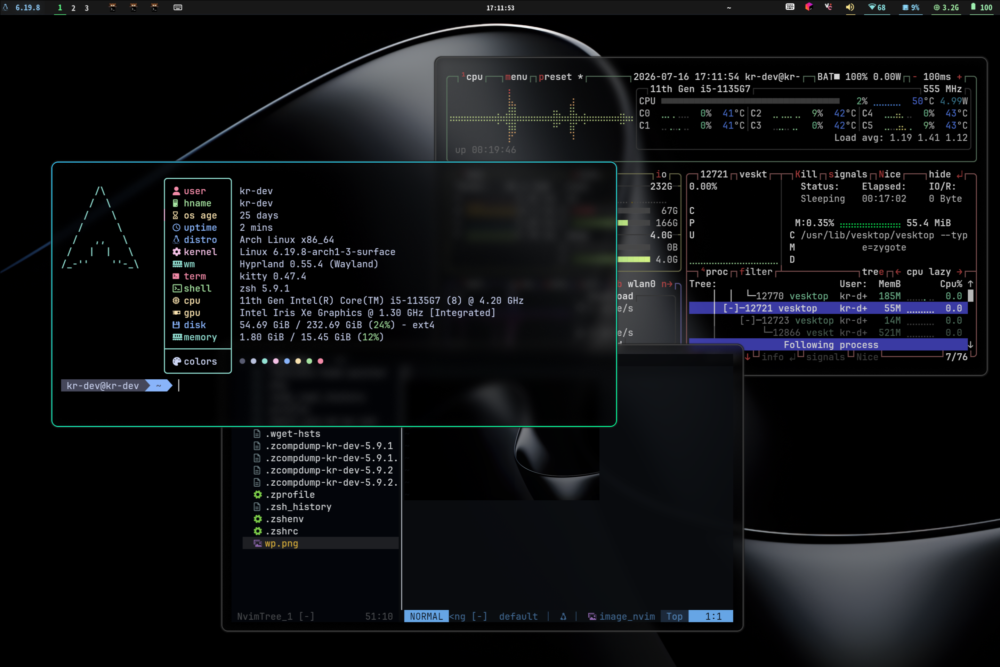

# dotfiles

This is the dotfiles I mainly use.

---
I’m the only one using it, so there’s no installation script.

I’m hoping someone will submit a pull request.

Or you could simply apply them and admire my magical configuration files.
