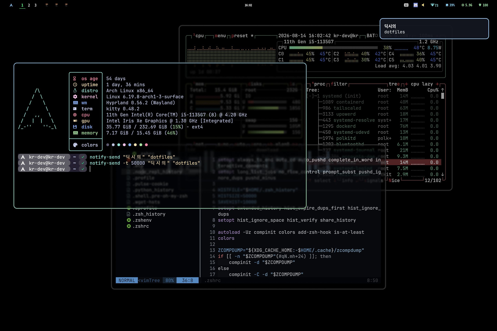

# dotfiles

These dotfiles are insanely good and look amazing—if you have an OLED screen, they might even help slow down global warming. Basically, they’re just top-tier dotfiles.



---

## Install

```sh
git clone https://github.com/dxdxffgg99/dotfiles.git ~/dotfiles
cd ~/dotfiles
make install
```

`make install` symlinks every config into `$HOME`. Anything already there is moved to
`~/.dotfiles-backup/<timestamp>/` first, so nothing is silently destroyed.

| command | what it does |
| --- | --- |
| `make install` | symlink everything |
| `make copy` | copy the files instead of symlinking |
| `make dry-run` | show what would happen, change nothing |
| `make status` | which files are linked / copied / differ / missing |
| `make uninstall` | remove the symlinks that point into this repo |
| `make deps` | check for the programs these configs need |
| `make waybar` | install one group only |

Groups: `zsh starship wallpaper kitty waybar rofi hypr nvim btop mako fastfetch`.
Flags: `COPY=1`, `DRY_RUN=1`, `NO_BACKUP=1` (e.g. `make hypr DRY_RUN=1`).

`./install.sh --help` does the same thing without make.

Notes:

- `.config/.zshrc` goes to `~/.zshrc`; everything else keeps its path under `$XDG_CONFIG_HOME`.
- The zsh config expects oh-my-zsh plus `zsh-autosuggestions` and `zsh-syntax-highlighting`
  in `~/.oh-my-zsh/custom/plugins/` -- `make deps` tells you if they are missing.
- `.config/hypr/hyprlock.conf` has an absolute wallpaper path in it; edit it if your
  username is not `kr-dev`.
